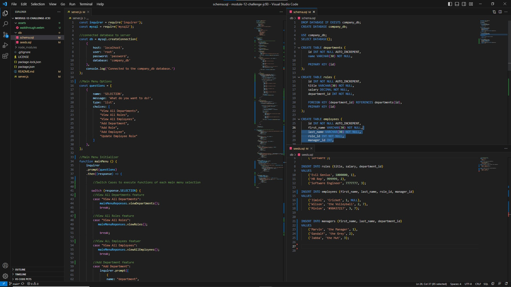

# Module 12 Challenge: Employee Tracker

## Technology Used 

| Technology Used         | Resource URL           | 

| Javascript     | [https://developer.mozilla.org/en-US/docs/Web/Javascript](https://developer.mozilla.org/en-US/docs/Web/JavaScript)      | 
| npm | [https://www.npmjs.com/](https://www.npmjs.com/)     |     
| mysql2 | [https://www.npmjs.com/package/mysql2](https://www.npmjs.com/package/mysql2)     |     
| inquierer | [https://www.npmjs.com/package/inquirer](https://www.npmjs.com/package/inquirer)     |   
| Git | [https://github.com/](https://github.com/)     |    

## Description

A command line application that allows the user to view and make edits to a series of sql tables, through the command line. There are 4 tables that the user can work with, (Departments, Roles, Employees, Managers), and there is no limit to the number of entries that can be made to each table. 

## Installation

1. Download Repository
2. Navigate to Rook Directory
3. Run npm install

## Usage

1. Complete Installation
2. Run npm start

## Learning Points

The purpose of this challenge was to practice creating, referencing and making edits to sql tables through javascript. We were also strongly encouraged to use mysql2 and inquirer, and were strongly discouraged from using sequalizer. 

## Credits

* [LinkedIn](https://linkedin.com/in/justinchoica)
* [Github](https://github.com/justinschoi93)
* [Email](justinschoi93@gmail.com)
